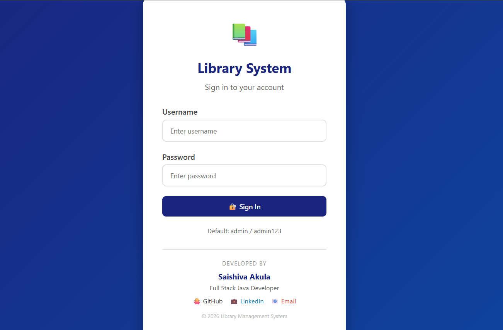
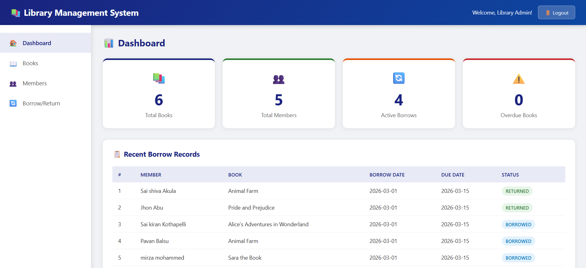
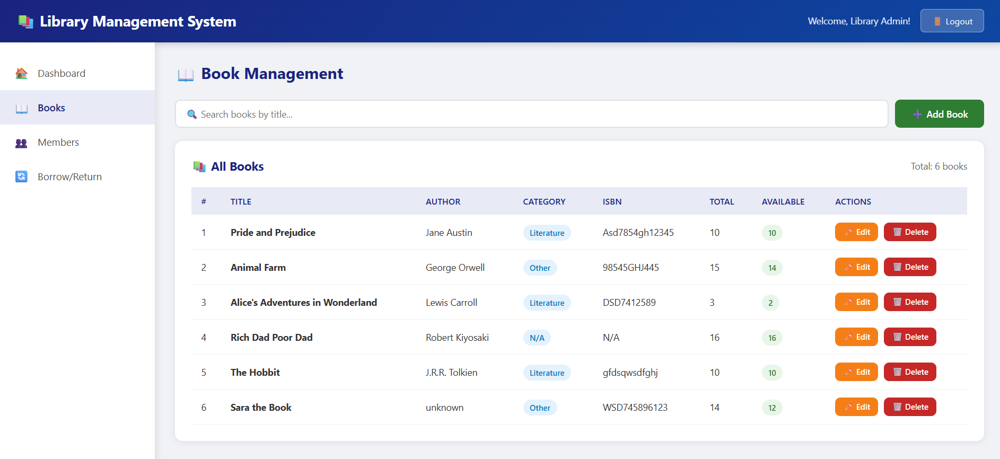
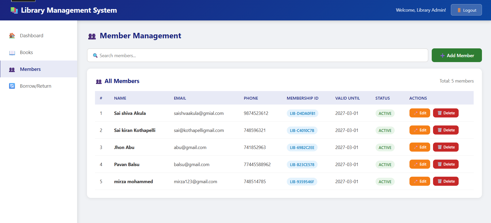

# 📚 Library Management System


<div align="center">


**A production-ready Full Stack Library Management System**

[🔴 Live Demo](https://librarymanagementsystem-saishiva.netlify.app/) · [📖 API Docs](#api-documentation) · [🐛 Report Bug](issues) · [✨ Request Feature](issues)

</div>

---

## 📋 Table of Contents
- [About](#about)
- [Features](#features)
- [Tech Stack](#tech-stack)
- [Architecture](#architecture)
- [Installation](#installation)
- [API Documentation](#api-documentation)
- [Screenshots](#screenshots)
- [Contact](#contact)

---

## 📖 About

A complete **Full Stack Library Management System** that handles books, members, and borrowing operations. Built with a professional layered architecture using Java Spring Boot for the backend and vanilla JavaScript for the frontend.

This project demonstrates real-world software engineering practices including:
- RESTful API design
- Dual database architecture (MySQL + MongoDB)
- Frontend-Backend integration
- Cloud deployment

---

## ✨ Features

### Book Management
- ✅ Add, edit, delete books
- ✅ Search books by title, author, category
- ✅ Track available vs total quantity
- ✅ ISBN management

### Member Management
- ✅ Register new members with auto-generated Membership ID
- ✅ 1-year membership validity tracking
- ✅ Member status management (Active/Inactive/Suspended)

### Borrow & Return System
- ✅ Issue books to members
- ✅ Return books with fine calculation
- ✅ 14-day borrow period
- ✅ ₹5/day overdue fine
- ✅ Borrow history saved in MongoDB

### Authentication
- ✅ User registration and login
- ✅ Role-based access (Admin/Librarian/User)
- ✅ Session management

### Dashboard
- ✅ Real-time statistics
- ✅ Recent borrow records
- ✅ Overdue book alerts

---

## 🛠️ Tech Stack

| Layer | Technology |
|-------|-----------|
| Backend | Java 21, Spring Boot 3.5 |
| ORM | Spring Data JPA, Hibernate |
| Primary DB | MySQL 8.0 |
| Secondary DB | MongoDB 8.2 |
| Frontend | HTML5, CSS3, JavaScript |
| Build Tool | Maven |
| API Testing | Postman |
| Deployment | Railway (Backend), Netlify (Frontend) |

---

## 🏗️ Architecture

```
┌─────────────────────────────────────┐
│         Frontend Layer              │
│   HTML + CSS + JavaScript           │
│   Fetch API → REST Endpoints        │
└──────────────┬──────────────────────┘
               │ HTTP Requests
┌──────────────▼──────────────────────┐
│         Controller Layer            │
│   BookController, MemberController  │
│   AuthController, BorrowController  │
└──────────────┬──────────────────────┘
               │
┌──────────────▼──────────────────────┐
│          Service Layer              │
│   BookService, MemberService        │
│   AuthService, BorrowService        │
└──────────────┬──────────────────────┘
               │
┌──────────────▼──────────────────────┐
│        Repository Layer             │
│   MySQL Repositories (JPA)          │
│   MongoDB Repositories              │
└──────────┬───────────┬──────────────┘
           │           │
    ┌──────▼──┐   ┌────▼──────┐
    │  MySQL  │   │  MongoDB  │
    │  Books  │   │  History  │
    │ Members │   │   Logs    │
    │  Users  │   └───────────┘
    │ Borrows │
    └─────────┘
```

---

## ⚙️ Installation

### Prerequisites
```
✅ Java JDK 21+
✅ MySQL 8.0+
✅ MongoDB 8.2+
✅ Maven 3.8+
✅ Git
```

### Step 1: Clone the Repository
```bash
git clone https://github.com/saishiva-akula/library-management-system.git
cd library-management-system
```

### Step 2: Configure Database
Open `src/main/resources/application.properties`:
```properties
spring.datasource.url=jdbc:mysql://localhost:3306/librarydb?createDatabaseIfNotExist=true
spring.datasource.username=root
spring.datasource.password=YOUR_PASSWORD

spring.data.mongodb.host=localhost
spring.data.mongodb.port=27017
spring.data.mongodb.database=librarydb_mongo
```

### Step 3: Run the Application
```bash
./mvnw spring-boot:run
```

### Step 4: Access the Application
```
Frontend:  http://localhost:8080/index.html
Backend:   http://localhost:8080/api
```

### Default Login
```
Username: admin
Password: admin123
```

---

## 📡 API Documentation

### Authentication APIs

#### Register User
```http
POST /api/auth/register
Content-Type: application/json

{
    "username": "admin",
    "password": "admin123",
    "email": "admin@library.com",
    "fullName": "Library Admin",
    "role": "ADMIN"
}
```

#### Login
```http
POST /api/auth/login
Content-Type: application/json

{
    "username": "admin",
    "password": "admin123"
}
```
**Response:**
```json
{
    "message": "Login successful!",
    "userId": 1,
    "username": "admin",
    "role": "ADMIN",
    "fullName": "Library Admin"
}
```

---

### Book APIs

#### Get All Books
```http
GET /api/books
```

#### Add Book
```http
POST /api/books
Content-Type: application/json

{
    "title": "Java Programming",
    "author": "James Gosling",
    "isbn": "978-0-13-468599-1",
    "category": "Programming",
    "publisher": "Oracle Press",
    "publishedYear": 2022,
    "totalQuantity": 5,
    "description": "Complete Java Guide"
}
```

#### Update Book
```http
PUT /api/books/{id}
```

#### Delete Book
```http
DELETE /api/books/{id}
```

#### Search Books
```http
GET /api/books/search/title?keyword=java
GET /api/books/search/author?keyword=gosling
```

---

### Member APIs

#### Add Member
```http
POST /api/members
Content-Type: application/json

{
    "firstName": "Sai",
    "lastName": "Akula",
    "email": "sai@gmail.com",
    "phone": "9999999999",
    "address": "Hyderabad, India"
}
```

#### Get All Members
```http
GET /api/members
```

---

### Borrow APIs

#### Issue Book
```http
POST /api/borrow/issue?memberId=1&bookId=1
```

#### Return Book
```http
PUT /api/borrow/return/{borrowRecordId}
```

#### Get Active Borrows
```http
GET /api/borrow/active
```

#### Get Overdue Books
```http
GET /api/borrow/overdue
```

---

## 📸 Screenshots

### Login Page


### Dashboard


### Books Management


### Member Management


### Borrow System


---

## 📁 Project Structure

```
library-management-system/
├── src/
│   ├── main/
│   │   ├── java/com/library/
│   │   │   ├── controller/
│   │   │   │   ├── BookController.java
│   │   │   │   ├── MemberController.java
│   │   │   │   ├── AuthController.java
│   │   │   │   └── BorrowController.java
│   │   │   ├── service/
│   │   │   │   ├── BookService.java
│   │   │   │   ├── MemberService.java
│   │   │   │   ├── AuthService.java
│   │   │   │   └── BorrowService.java
│   │   │   ├── repository/
│   │   │   │   ├── mysql/
│   │   │   │   └── mongodb/
│   │   │   ├── model/
│   │   │   │   ├── mysql/
│   │   │   │   └── mongodb/
│   │   │   └── LibraryManagementApplication.java
│   │   └── resources/
│   │       ├── static/          ← Frontend files
│   │       ├── application.properties
│   │       └── application-prod.properties
│   └── test/
├── screenshots/
├── pom.xml
└── README.md
```

---

## 🤝 Contributing

1. Fork the project
2. Create your feature branch (`git checkout -b feature/AmazingFeature`)
3. Commit changes (`git commit -m 'Add AmazingFeature'`)
4. Push to branch (`git push origin feature/AmazingFeature`)
5. Open a Pull Request

---

## 📄 License

Distributed under the MIT License. See `LICENSE` for more information.

---

## 📬 Contact

**Saishiva Akula**
- LinkedIn: [linkedin.com/in/saishiva-akula](https://linkedin.com/in/saishiva-akula)
- Email: saishivaakula9381@gmail.com
- GitHub: [@saishiva-akula](https://github.com/saishiva-akula)

---

<div align="center">
⭐ Star this repository if you found it helpful!
</div>
